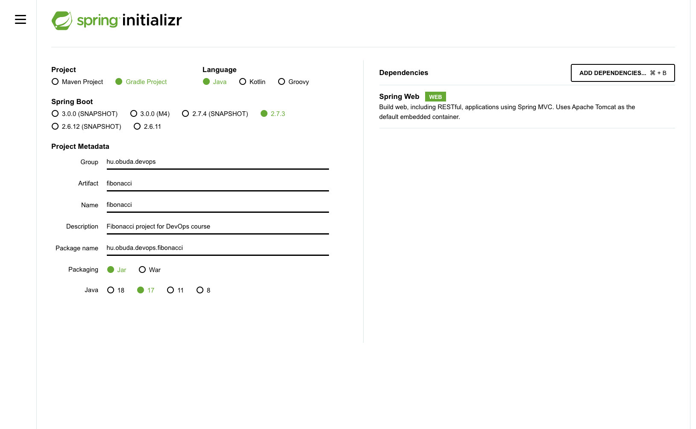
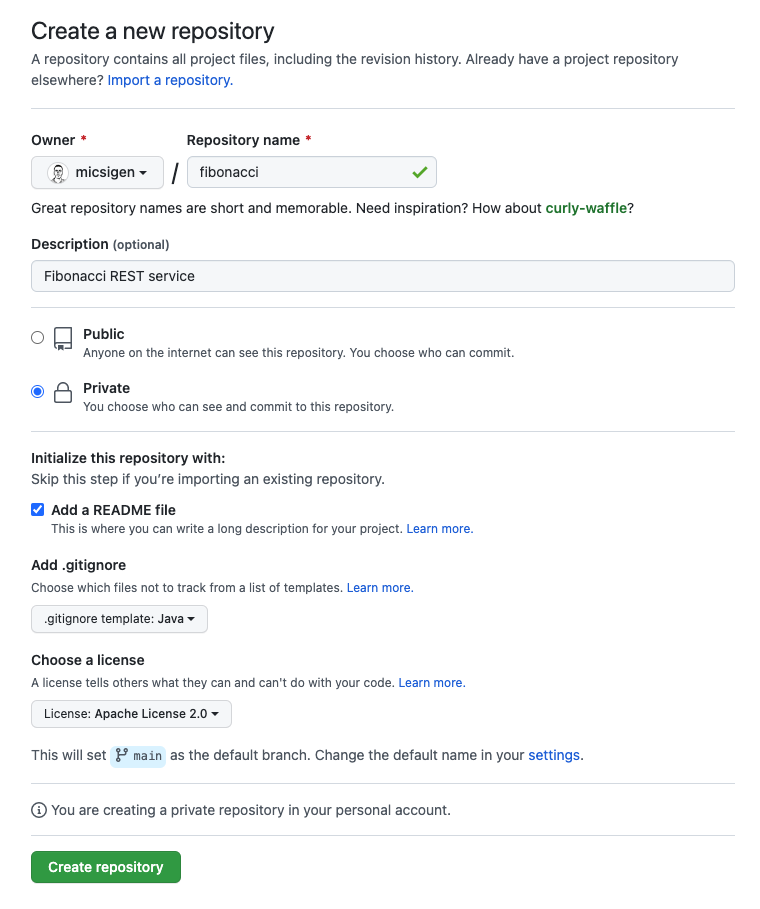

# Fibonacci backend service with Spring

This guide walks you through the process of creating a *Fibonacci* number application with Spring.

# What You Will Build

You will build an backend application that will accept HTTP GET requests at: `http://localhost:8080/fibonacci?n=5`.

It will respond a static page that body will contain a *n.* fibonacci number.

The Fibonacci number are represented with the next expression:

```
f(n) = f(n - 1) + f(n - 2)
```

Especially:
```
f(1) = 0
f(2) = 1
f(3) = 1
f(4) = 2
f(5) = 3
f(6) = 5
...
```

# What You Need

- Create a GitHub account if you do not have yet: https://github.com/signup
- Java RE Version 17: https://www.oracle.com/java/technologies/javase/jdk17-archive-downloads.html
- Gradle Version: https://gradle.org/releases/
- Visual Studio Code: https://code.visualstudio.com/download

# Steps

Next steps help to build an contribute the *Fibonacci* application.

## Create a application trunk with Spring Initializr

To manually initialize the project:

- Navigate to https://start.spring.io.
This service pulls in all the dependencies you need for an application and does most of the setup for you.
- Choose Gradle and the language you want to use. This guide assumes that you chose Java.
- Click *Dependencies* and select *Spring Reactive Web*.
- Click *Generate*.
- Download the resulting ZIP file, which is an archive of a web application that is configured with your choices.

NOTE: If your IDE has the Spring Initializr integration, you can complete this process from your IDE.



## Create a new project on GitHub

To complete the task needed to create and upload the running application into GitHub. Use the next template to create the project.



## Develop the Fibonacci application

The layers are shown on the next diagram.


### Create a Controller layer

In Spring's approach to building web sites, HTTP requests are handled by a controller. You
can easily identify the controller by the @Controller annotation. 

This controller is concise and simple, but there is plenty going on. We break it down step
by step.

The `@GetMapping` annotation ensures that HTTP GET requests to `/fibonacci` are mapped to
the `fibonacci()` method.

{RequestParam}[`@RequestParam`] binds the value of the query string parameter `n` into
the `name` parameter of the `greeting()` method. This query string parameter is not
`required`. If it is absent in the request, the `defaultValue` of `World` is used. The
value of the `name` parameter is added to a {Model}[`Model`] object, ultimately making it
accessible to the view template.

## Run the Application

After you complete the task you can run the application with the next *Gradle* command.


## Test the Application

### Unit tests

### Integration tests


### Manual test

Now that the web site is running, visit `http://localhost:8080/fibonacci?n=10`, where you should
see "54"
